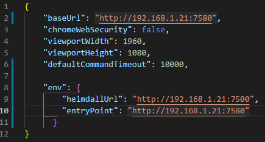

# Install:

`npm install`

# Config:

Konfiguracja w pliku cypress.json:

*  baseUrl - adres front-u
*  heimdallUrl - adres Heimdall-a
*  entryPoint - adres back-u

# Running:

`npm run cypress` - odpala GUI test runnera

`npm run cypressHeadless` - odpala testy headless-owo w Electronie